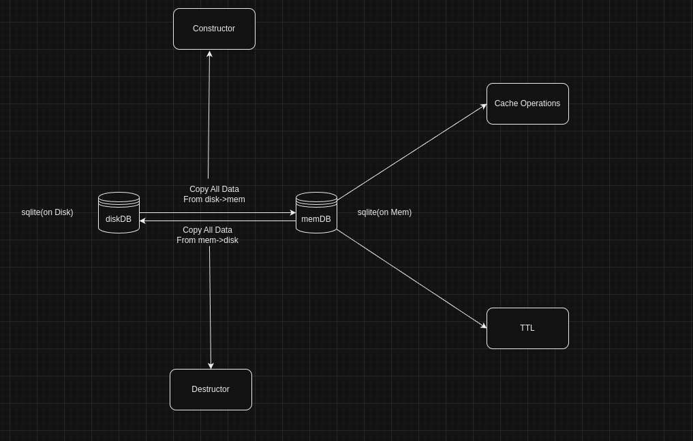

# cachesqlite



## `Intro`
  * CacheSQLite is a caching solution that merges the simplicity of SQLite with the efficiency of in-memory storage, akin to Redis. This project serves as a   wrapper around SQLite, providing a robust system for managing string key-value pairs while integrating an inbuilt Time-To-Live (TTL) checker for automatic cache expiration. Built using CGo—a combination of C and Go leverages GCC compiler optimizations to enhance performance, making it an ideal choice for developers seeking a lightweight yet powerful caching mechanism.

  * `Installation`
```bash
go get github.com/dev-hack95/cachesqlite
```

  * `Note`: Currently helper package is working with gin/gonic framework but you can tweak the helper packge according your need of framework